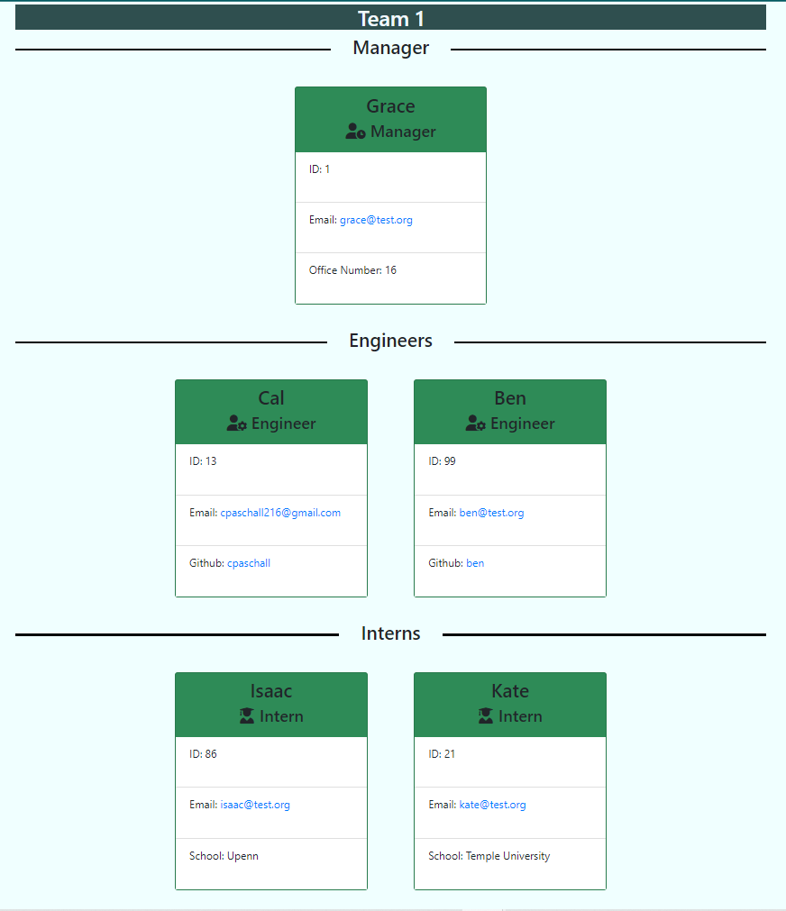

  

  # Team Generator

  ## Description
  Add Manager, Engineer and Intern roles to employer cards that display the employee's name , role, email and ID.  Depending on the role, the card will display the manager's office number, the engineers Github user name with a link to their Github page and the Intern's school.  All email addresses will link to the user's default email application along with the employee's email address in the 'to' line. 

  ## Instructions
  The following npm commands will need to be executed to intall the necessary modules for the application: 
  ```
  npm inity --y  
  npm i inquirer
  npm i jest
  ```
  The **test** value should be updated in *package.json* under the **debug** section within **scripts**:
  ```
  "scripts": {
    "test": "jest --verbose"
  },
  ```

  ## Usage
  Navigate to the directory containing the application within a terminal.  Make sure the necessary modules have been installed.  Excute the following command:
  ```
  node index
  ```
  The application will run and prompt the user for their responses.  Once completed, a *index.html* file will be created under the *dist* directory.  View a walkthrough video [**here.**](https://drive.google.com/file/d/1VhlqWCshKWuWH8BvNDHibqww-iLZC5Kt/view)
  
  

  ## Contributing
  Contact me to ask to be added to the repository as a contributor.

  ## Tests
  Tests were perfomred on the 4 main classes, located under the *_tests_* directory. To run the tests, execute the following commnad in a terminal while in the applications file path: 
  ```
  npm test
  ```

  ## Questions
  Github: [cpaschall](https://github.com/cpaschall)
  <br>
  Email: cpaschall216@gmail.com

  ---

  [License: Apache 2.0](https://opensource.org/licenses/Apache-2.0)
 
  